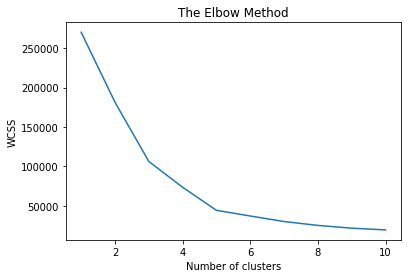

# kmeans-elbow-method-clustering

### Elbow Method: 
Used to find the optimal number of clusters byb callculating Within Cluster Sum of Squares (WCSS)
* Looks at the distance between each point and the centroid of its cluster, and it squares the distance, until the output is zero
* The fewer the clusters the larger the WCSS / distance between points at its centroid

Selecting number of clusters:

Sample using method to determine clusters:

